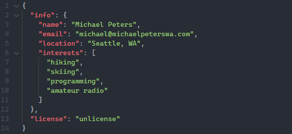

---
 

  

 
### 🌲 what's up 🌲

I hear emoji's are all the rage now, so here is one of my favorites, a 🏔️ (snow-capped mountain). Other than computing, being outdoors is my passion. I've done everything from ⛷️ (skiing) to 🧗 (climbing) to 🚵 (mountain biking). I am also a member of our local Search and Rescue ⛑️ group and it is my passion to help my community in their times of need. Keep learning! Every day brings a new adventure.

---

### tasks
- [ ] learn svelte/create project using svelte
- [ ] more hardware projects (esp8266 or RPi)
- [ ] amateur radio digital modes
- [ ] dart app (for XC-Skiing conditions)
