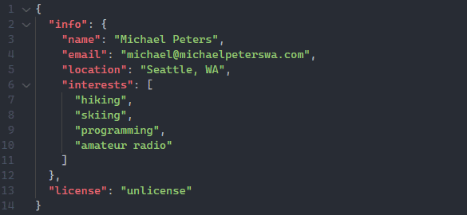

---
 

  

 
### 🌲 what's up 🌲

I hear emoji's are all the rage now, so here is one of my favorites, a 🏔️ (snow-capped mountain). Other than computing, being outdoors is my passion. I've done everything from ⛷️ (skiing) to 🧗 (climbing) to 🚵 (mountain biking). I am also a member of our local Search and Rescue ⛑️ group and it is my passion to help my community in their times of need. Keep learning! Every day brings a new adventure.

---

    

---

### tasks
- [x] learn svelte/create project using svelte
- [ ] private, selfhosted, encrypted iOS messaging app
- [x] learn gatsby/create project using gatsby
- [x] self-hosted location tracker (JS backend and iOS frontend) 
- [ ] utilize LoRa transmission protocol
- [x] more hardware projects (esp8266 or RPi)
- [ ] amateur radio digital modes
- [x] Open Source Location Tracking server/iOS app
- [x] I-90 Trailheads swift app 
- [ ] dart app (for XC-Skiing conditions)
- [ ] service discovery platform
